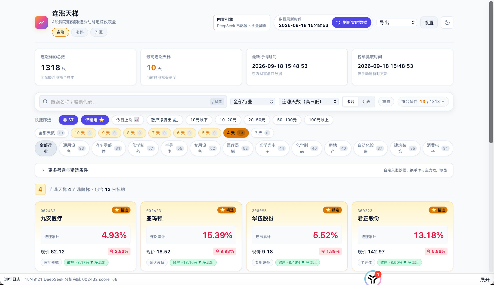
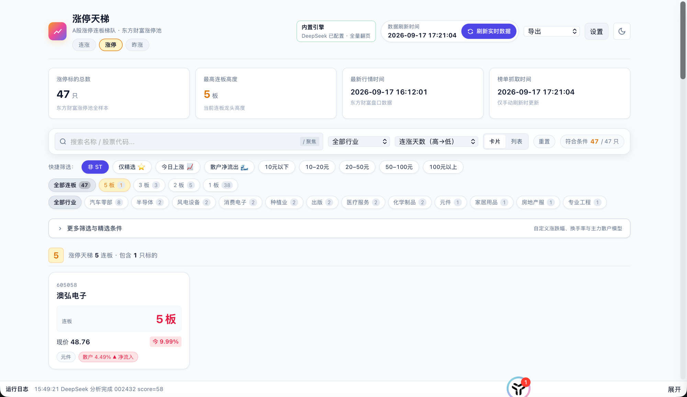
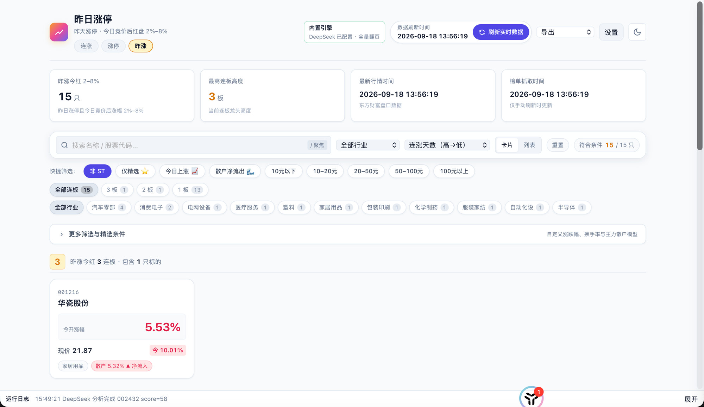
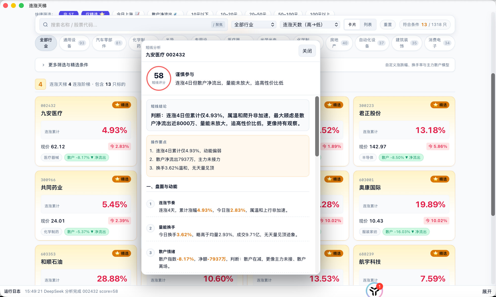

# 连涨天梯

桌面工作台：从同花顺抓取连续上涨榜，叠加东方财富当日行情（现价、涨跌幅、今开高低、换手、成交额、市盈率、散户资金），在窗口里筛选、精选并导出。

抓取在软件内部完成，不依赖本机 Python、uv 或仓库脚本。打开只读本地快照；点击「刷新实时数据」才会联网。

**本项目仅供学习交流**，不构成任何投资建议。详见文末[免责说明](#免责说明)。

## 下载

从 [GitHub Releases](https://github.com/uasier/gp-ladder/releases) 获取安装包：

- macOS：`gp-ladder_*_aarch64.dmg`（Apple Silicon）/ `gp-ladder_*_x64.dmg`（Intel）；未签名，首次请右键 → 打开
- Windows：`gp-ladder_*_x64-setup.exe`（未签名，SmartScreen 可能提示「仍要运行」）

应用内 **设置 → 关于** 可检查更新，并下载当前系统对应的安装包。

## 界面预览

**连涨天梯** — 同花顺连涨榜叠加东方财富行情，按天数、行业、精选筛选。



**涨停天梯** — 东方财富涨停池，按连板高度分档。



**昨日涨停** — 昨天涨停，今日竞价后红盘且涨幅 2%–8%。



**DeepSeek 短线分析** — 右键个股，按 1–5 个交易日视角看盘，并给出 0–100 短线评分。



## 环境

- Node 18+
- Rust 1.77+（推荐最新 stable）

## 开发

```bash
npm install
npm test
npm run test:rust
npm run tauri dev
```

打包：

```bash
npm run tauri build
# 或按平台
npm run tauri:build:mac    # .app / .dmg
npm run tauri:build:win    # NSIS（需 Windows 工具链或交叉编译）
```

同一套前端的 Web 服务（默认端口 **40300**）：

```bash
npm run server
# http://localhost:40300
```

设置与快照在本机应用目录（macOS：`~/Library/Application Support/com.gp.ladder.app/`）。

## 功能

- 连涨天梯、涨停天梯、昨日涨停（顶部「昨涨」：昨天涨停，今日竞价后红盘且涨幅 2%–8%）
- 行业、天数、涨幅、换手、散户指数、精选筛选
- 个股抽屉详情
- 右键股票按短线视角调用 DeepSeek 看盘（动能、量价、买点止损），并给出 0–100 短线评分
- 导出 HTML / CSV / JSON
- 刷新进度与运行日志
- 检查 GitHub Release 更新并下载安装包

## 仓库结构

```text
.
├── src/                 # React 界面
├── src-tauri/           # Rust 宿主：抓取、行情、快照、导出
│   ├── src/
│   │   ├── crawl.rs     # 同花顺连涨榜
│   │   ├── quotes.rs    # 东方财富行情
│   │   ├── pipeline.rs  # 刷新管线
│   │   └── ...
│   └── templates/ladder.html
├── docs/screenshots/    # README 界面截图
├── LICENSE
├── package.json
└── README.md
```

## 发布

三个版本号必须一致：`package.json`、`src-tauri/tauri.conf.json`、`src-tauri/Cargo.toml`。

```bash
# 只校验
npm run version:check

# 同步三个文件到指定版本（不提交）
npm run version:set -- 0.2.0

# 同步版本、提交并打 annotated tag（不推送）
npm run release:tag -- 0.2.0
git push origin HEAD && git push origin v0.2.0
```

推送 `v*` tag 后，GitHub Actions 会在 macOS arm64 / macOS x64 / Windows x64 构建，并上传到该 tag 的 GitHub Release。也可在 Actions 里手动 `workflow_dispatch`，填已有 tag 补传安装包。

## 注意事项

- 需要能访问 `data.10jqka.com.cn` 与 `push2delay.eastmoney.com`。
- 页面结构若变更，解析可能失败；可在设置里把「最多抓取页数」设为 1 试跑。
- 安装包未签名。macOS 请右键 App 选择「打开」；Windows 如遇 SmartScreen，选择「仍要运行」。

## 免责说明

**本项目仅供学习交流。** 连涨天梯是开源的行情浏览与辅助分析工具，不得用于商业荐股或代客理财，**不是**证券公司、投资顾问或任何持牌金融机构提供的产品或服务。

- **不构成投资建议。** 界面中的榜单、筛选、精选标记、评分以及 DeepSeek 等模型生成的文字，仅为基于公开数据的展示与讨论，不构成买入、卖出、持有或任何证券投资建议，也不能替代独立研究与专业意见。
- **数据可能不准、延迟或中断。** 行情与榜单来自同花顺、东方财富等第三方网站或接口，本软件不保证完整性、及时性或准确性，也不对数据源变更、限制访问或解析失败负责。
- **模型可能出错。** 短线分析由第三方大模型生成，可能遗漏、过时或编造事实，请自行核对原始行情与公告。
- **投资有风险。** 证券市场可能造成本金损失。是否交易、如何交易由使用者自行决定，并自行承担全部盈亏与法律责任。开发者、贡献者不对使用本软件导致的任何直接或间接损失负责。
- **合规由使用者自行判断。** 请遵守所在地证券、数据与软件使用相关法律法规，以及数据源网站的使用条款。

使用、下载或继续运行本软件，即表示已阅读并同意上述说明。

## 许可证

本项目采用 [MIT License](LICENSE) 发布。
